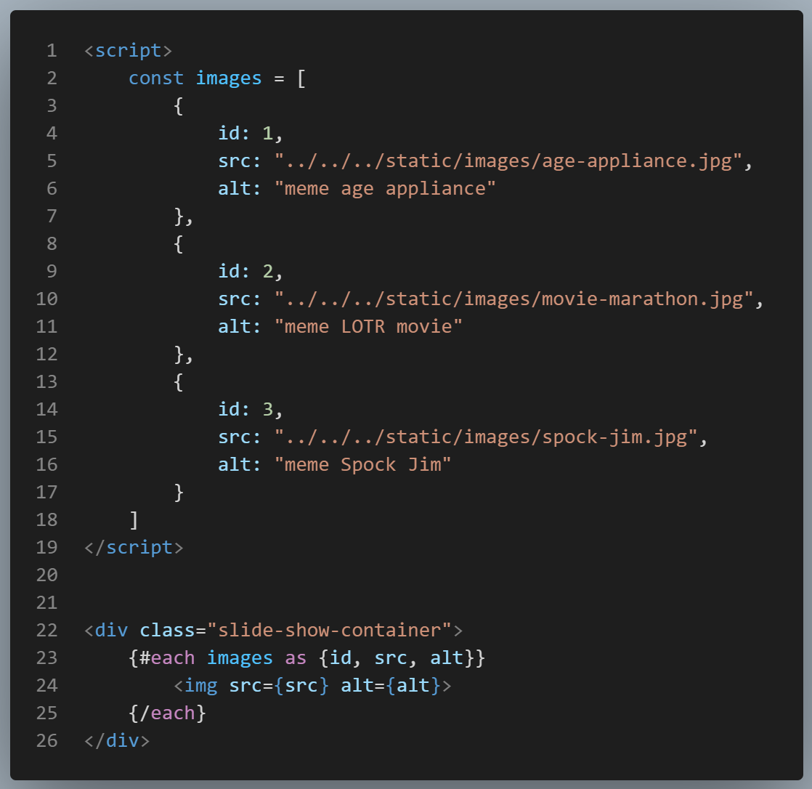

_This article is still **in progress**_
## Preparing for the Project

To get started you should have a few things ready to go:

1. **Have a SvelteKit project set up.** <a href="./Svelte-Kit-Setup.md">How to set up a SvelteKit project</a>
2. **In your static folder add 3 images to use while we get this working**. I get free images from Pexels.
3. **In your lib/components folder make a slide-show.svelte file.** This will be your component which you can then import into any file.
4. **Make a file(route) to import your component into** while working on this project so we can display it in the server. I named mine slide-show.md. I used markdown, but you can use a svelte file also.

<SlideShow />

So I have made the files, added the photos, made my component and imported into my slide-show.md route. I added an images folder inside of static to hold my pictures, this is optional.

My slide-show component at this point is very basic, it just displays the pictures on the page they are imported into. To do this I started with a script tag and made an array called images. Inside of the array each image is an object containing **src**, **alt** and **id**.

    

